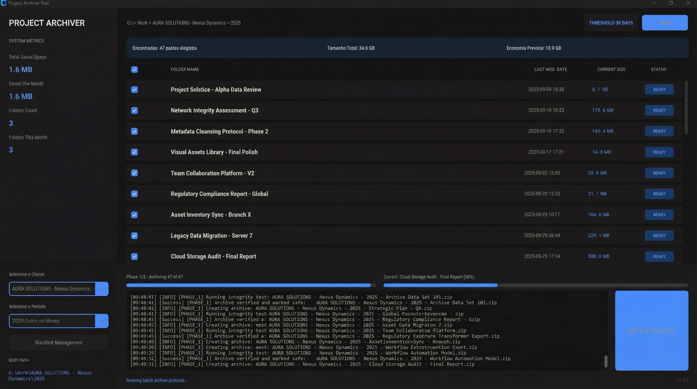

# Project Archiver Tool

A Windows-based automation utility for creative professionals to archive and manage inactive project folders safely.

## Preview


Before publishing the repository, create an `assets/` folder screenshot with generic project names only and save it as `assets/screenshot.png`.

## Description

Project Archiver Tool is a CustomTkinter-based desktop application designed to scan a structured project directory, identify inactive project folders, compress them into ZIP archives, validate the archive integrity, and only then remove the original folders.

The application focuses on safety first:
- two-phase batch processing
- archive integrity validation
- final verification before deletion
- responsive UI during long-running file operations

## Key Features

- Two-Phase Archiving protocol for safer batch execution
- ZIP integrity checks using `zipfile.testzip()`
- Final verification before any folder deletion
- Dual progress bars for batch and current item progress
- Sidebar dashboard with archive analytics
- Scan summary with estimated savings
- Dynamic root path selection
- PT-BR / English language toggle
- Blacklist support for ignored folders

## Required Folder Structure

The tool expects projects to follow this hierarchy:

```text
SOURCE_PATH_HERE/
  Customer/
    Year/
      01 - January/
        Project_A/
      02 - February/
        Project_B/
```

Naming output format:

```text
[Customer] - [Year] - [Month] [Project Name].zip
```

Examples:
- `Client_Alpha - 2025 - March Project_2026.zip`
- `Client_Beta - 2026 - January Campaign_Delivery.zip`

## How Scanning Works

- If the selected root points to a month folder, the app scans only the direct child project folders.
- If the selected root points to a year folder, the app scans the month folders one level below and then the project folders inside them.
- A project is eligible when the project folder itself has not been modified for at least 30 days.

## Installation

### 1. Clone the repository

```bash
git clone https://github.com/your-username/project-archiver-tool.git
cd project-archiver-tool
```

### 2. Create and activate a virtual environment

```bash
python -m venv .venv
```

Windows PowerShell:

```powershell
.venv\Scripts\Activate.ps1
```

### 3. Install dependencies

```bash
pip install -r requirements.txt
```

### 4. Run the application

```bash
python main.py
```

Optional Windows launcher:

```text
start_project_archiver.bat
```

## Project Structure

```text
project-archiver-tool/
  assets/
  modules/
    database.py
    engine.py
    gui.py
    translations.py
  main.py
  README.md
  requirements.txt
  LICENSE
```

## Configuration

- `settings.json` stores the selected root path locally.
- `stats.json` stores local dashboard analytics.
- Both files are ignored by Git and are intended for local machine usage only.

If `settings.json` is missing or contains an invalid path, the application falls back to a safe default inside the current user's home directory.

## Safety Model

The archive workflow is intentionally split into two separate phases:

1. Phase 1: Archive and verify
   - create ZIP
   - validate existence and size
   - run integrity checks
   - mark only verified items as safe for deletion

2. Phase 2: Cleanup
   - re-check ZIP existence
   - reopen ZIP for a final verification
   - only then remove the original folder

This reduces the chance of accidental data loss during batch operations.

## Tech Stack

- Python 3.10+
- CustomTkinter
- Standard library modules for ZIP, JSON, threading, and file dialogs

## License

This project is distributed under the MIT License. See [LICENSE](LICENSE).
